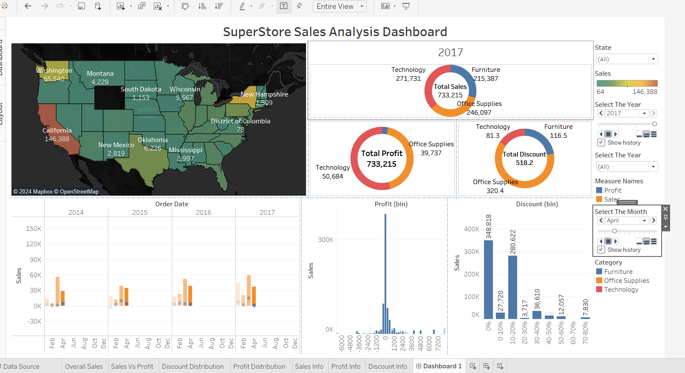

# SuperStore Sales Analysis Dashboard
Sales Analysis Using Superstore Dataset &amp; Tableau

## Project Overview

This Tableau dashboard provides an in-depth analysis of SuperStore sales data across different U.S. states from 2014 to 2017. The dashboard includes insights into total sales, profit distribution, discounts, and category-wise performance. The interactive features allow users to filter by state, year, and month, offering a dynamic view of sales trends over time.

## Data Source

- **Dataset:** [Superstore sales.xlsx](Superstore%20sales.xlsx)
- **Rows:** 9994
- **Columns:** 21
- **Fields Include:** Order Date, Sales, Profit, Discount, Product Category, Region, and State.

## Dashboard Sections

1. **Geographic Sales Analysis:** Heatmap displaying total sales by state.
2. **Category Breakdown:** Pie charts for total sales, profit, and discount across product categories (Technology, Furniture, Office Supplies).
3. **Time-Series Analysis:** Monthly sales trends from 2014 to 2017.
4. **Profit & Discount Distribution:** Visual representation of profit and discount distribution with binning.

## Key Insights

- **Highest Sales:** California leads in sales with over 146,000 USD.
- **Product Category Analysis:** Technology has the highest profit margin, while Office Supplies has the highest discount percentage.
- **Seasonal Trends:** Sales peak in November, aligning with Black Friday shopping.

## Getting Started

1. **Download Tableau Public:** If you don’t have Tableau, download [Tableau Public](https://public.tableau.com/).
2. **Open Dashboard:** Access the project on [Tableau Public](https://public.tableau.com/shared/7CY2QND83?:display_count=n&:origin=viz_share_link) or use the local `.twbx` file.
3. **Explore:** Use filters to adjust the year, month, and category view.

## Prerequisites

- **Tableau Public/Professional**
- **Python (optional)** for any data preprocessing with `Pandas` or `NumPy`

---

For any questions or feedback, please feel free to reach out. Happy analyzing!
